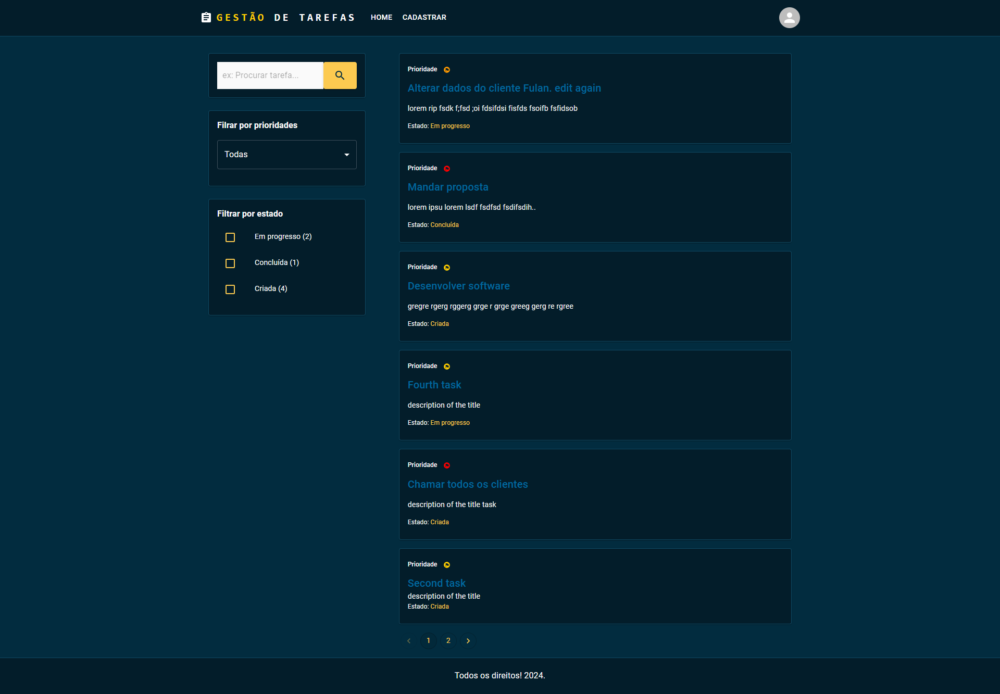
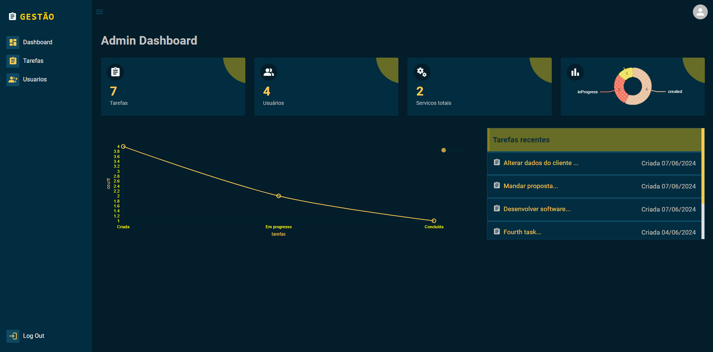
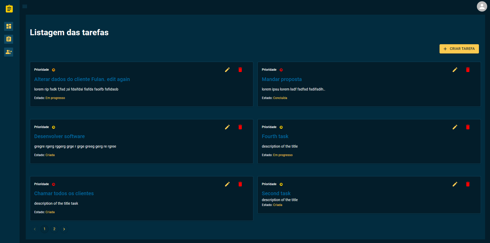

# Tasks management App
This is a Full stack App made with MERN Stack (Mongodb, ExpressJs, Nodejs and Typescript, Reactjs), MUI, Datagrid, cookie, etc. foget email reset email, etc.

##### To use this app: clone this repo, in the root of bonus folder create a .env file with these variables PORT=9000 DATABASE=YOUR_MONGO_URL JWT_SECRET=fidbfbFCDSm1558 NODE_ENV=development if in development mode and NODE_ENV=production if you're deploying your App; after that, run "npm install" in the bonus root folder. Go inside frontend folder in bonus folder, run "npm install "

# Features:
   FEATURES
   ##### - DESIGN AND FEATURES  OF THE SOFTWARE ARE MADE TO WORK IN REAL SCENARIO
   #####- AUTHENTICATION WITH Jason Web Token (JWT) AND COOKIE, IN PRODUCTION MODE COOKIE IS ONLY ACCESSIBLE WITH HTTPS
   ##### - SIGN IN, SIGN UP // validation front and back, minimum of 6 character in a password, valid format e-mail front and back
   ##### - FORGET AND RESET PASSWORD, SEND EMAIL WITH A LINK TO RESET THE PASSWORD IF EMAIL EXIST IN THE DATABASE.   LINK EXPIRATION 10MN AFTER SENDING.
  
 #####   - SEARCH SPECIFIC TASK,
 #####   - FILTER BY TASK STATUS (created, in progress, completed) AND SELECT ONE OR MORE STATUS, EACH STATUS HAS A NUMBER OF TASK SHOWING  AUTOMATICALLY
 #####   - FILTER BY PRIORITY (all, normal, medium, high), DWOPDOWN MENU. Each task has a priority with an icone color.
#####    - PAGINATION OF TASK
#####    - RESPONSIVE APP
#####    - HIGH ORDER COMPONENT (HOC), WE USE THE SAME TEMPLATE FOR BOTH ADMIN USER AND REGULAR USER
#####    - ADMIN DASHBOARD:
#####      . THE ADMIN DASHBOARD HAS SOME STATISTIC REPORT AND GRAPH TO SEE (number of task, number of users, 2 graphs about task status 
and recent tasks)
#####      . ADMIN CAN CREATE TASK, EDIT TASK, DELETE TASK, ATTRIBUTE A TASK TO A SPECIFIC USER
 #####     . ADMIN CAN LIST OF USER IN DATAGRID
#####      . ADMIN CAN ACTIVATE OR DEACTIVATE A USER, BY DEFAULT WHEN A USER IS CREATED IN THE SYSTEM HE'S NOT ACTIVE.
 #####     . DASHBOARD SIDEBAR  CAN OPEN AND CLOSE, DEFAULT CLOSE.
 #####   - USER DASHBOARD
  #####    . USER CAN SEE HIS PROFILE
#####      . USER CAN ONLY SEE TASK ATTRIBUTED TO HIM AND THE COMPLETE TASK DESCRIPTION
#####      . USER CAN ONLY EDIT AND UPDATE THE TASK STATUS
    
    
    
  ###  TECBHNOLGIES
   #####    - BACKEND: NODEJS, TYPESCRYPT, MONGODB, MONGOOSE, JASON WEB TOKEN, COOKIE-PARSER, EXPRESSJS, CORS, MORGAN, NODEMON, BODY-PARSE
 BCRYPTJS
  #####     - FRONTEND: REACTJS, MUI (MATERIAL UI), FORMIK, YUP VALIDATION, AXIOS, REACT-PRO-SIDEBAR, REACT-QUILL, MOMENT, REACT TOASTIFY, 
  #####       REDUX, SWEET ALERT, NIVO CHART (LINE AND PIE), DATAGRID, REACT-ROUTER-DOM.
    

